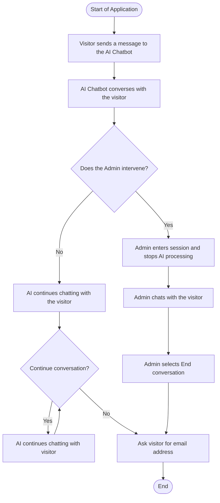

## System Overview

The application consists of two major layers. The current repository represents a working prototype of the intended solution, while the design and planning documents capture the confirmed production target state once the unresolved assumptions are implemented.

### Frontend

The frontend is implemented using **Next.js/React** and currently provides:

- A visitor-facing chat interface.
- In-browser conversation state for the active session.
- A responsive portfolio layout and the interactive eye animation.
- The admin prototype entry point and direct message channel for the prototype workflow.

### Backend

The backend is implemented using **FastAPI** and currently provides:

- Azure OpenAI integration for visitor conversation handling.
- Tool/function calling for resume retrieval.
- WebSocket connections for visitor-to-admin communication.
- Administrator access checks using `ALLOWED_ADMIN_IPS` and `ADMIN_TOKEN`.
- Environment-based configuration for resume and admin security settings.

FastAPI registers both the conversation and WebSocket routers. The current implementation supports prototype-level admin routing; the production target adds a protected admin interface and stricter deployment controls.

## Confirmed design decisions

The following assumptions are now resolved and reflected in the project documentation:

- The product shall retain visitor context across a revisit after at least one hour, but the current implementation still stores messages only in frontend memory and therefore requires a persistence layer.
- Resume format values remain metadata-driven and do not yet select distinct files by format; the configured `RESUME_LINK` is shared for the supported values until file selection is implemented.
- Admin intervention must halt AI processing for the targeted visitor session, but no takeover state is currently implemented.
- Admin credentials must come from backend configuration and not be exposed to the client; the prototype currently demonstrates the connection pattern but not final protected admin delivery.
- The production admin flow is expected to use HTTPS/REST for the admin page, while the current prototype uses WebSockets for direct message exchange.

## High-Level System Flow

The administrator takeover branch, end-conversation control, and email prompt are confirmed target-state behaviors. The current implementation can send a direct WebSocket message, but it does not yet maintain takeover state, stop AI processing, or collect email addresses.