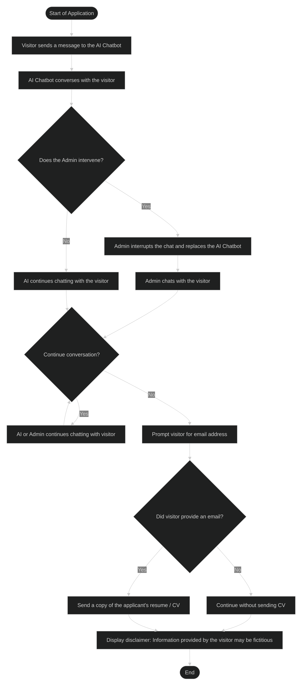

## System Overview

The application consists of two major layers.

### Frontend

The frontend is implemented using **Next.js/React** and provides:

Chat interface
User and bot/admin conversation

### Backend

The backend is implemented using **FastAPI** and provides:

Azure OpenAI integration.
AI tool/function calling.
WebSocket connections.
Administrator access.

FastAPI registers both the conversation and WebSocket routers.

## High-Level System Flow

flowchart TD

    A([Start of Application]) --> B[Visitor sends a message to the AI Chatbot]
    B --> C[AI Chatbot converses with the visitor]
    C --> D{Does the Admin intervene?}
    D -- Yes --> F[Admin interrupts the chat and replaces the AI Chatbot]
    D -- No --> E[AI continues chatting with the visitor]
    F --> G[Admin chats with the visitor]
    E --> H{Continue conversation?}
    G --> H
    H -- Yes --> I[AI or Admin continues chatting with visitor]
    I --> H
    H -- No --> J[Prompt visitor for email address]
    J --> K{Did visitor provide an email?}
    K -- Yes --> L[Send a copy of the applicant's resume / CV]
    K -- No --> M[Continue without sending CV]
    L --> N[Display disclaimer: Information provided by the visitor may be fictitious]
    M --> N
    N --> O([End])